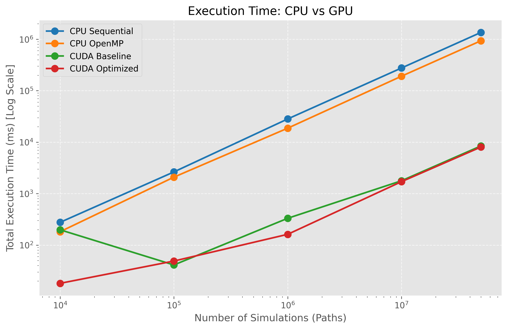
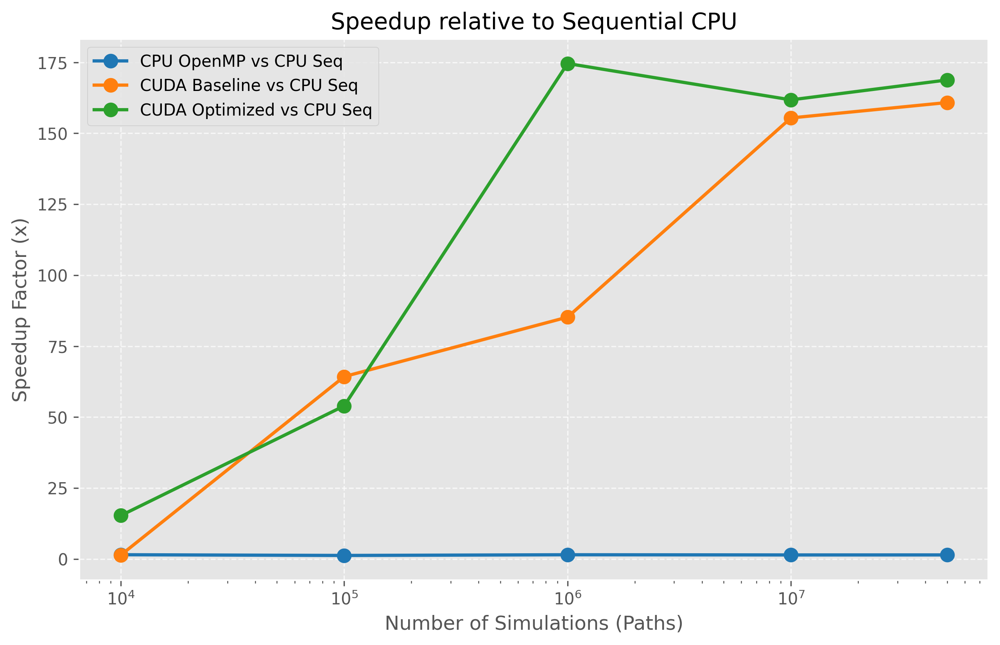
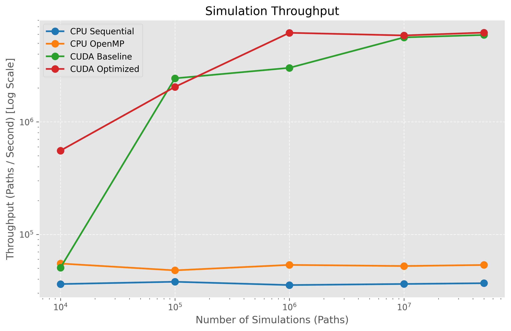
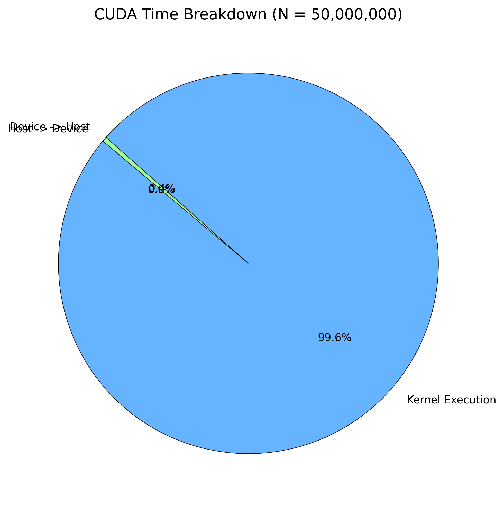
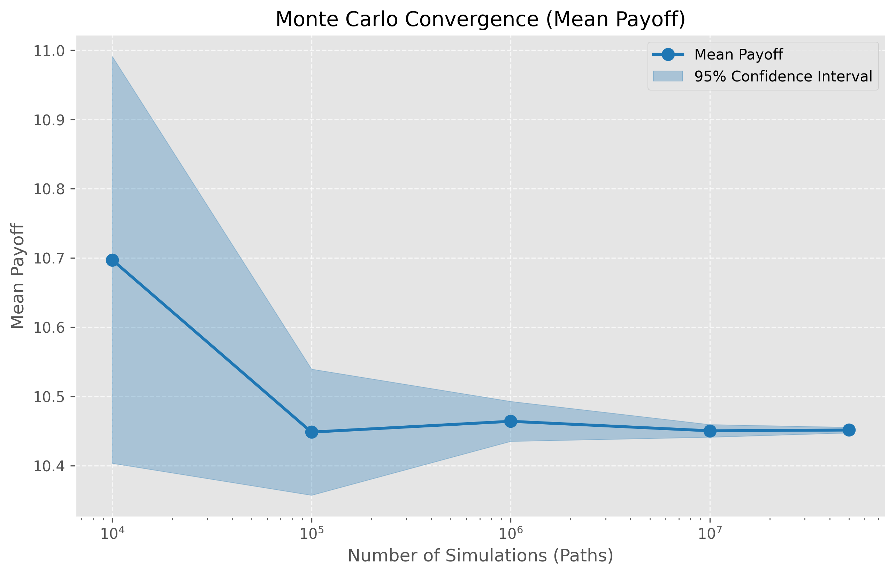
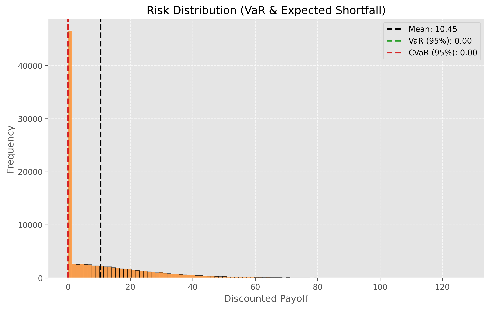
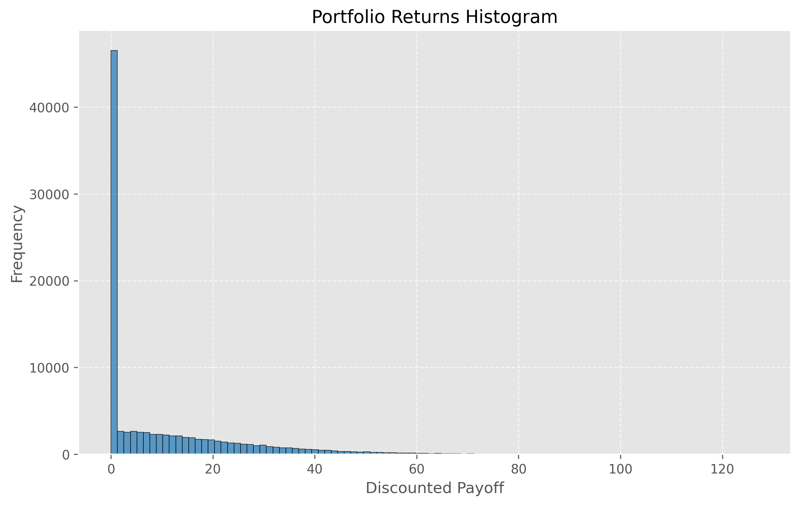

# Risk Analyst: GPU Accelerated Financial Risk Analytics


Risk Analyst is a high-performance quantitative finance engine that demonstrates how modern **C++20** and **CUDA** can accelerate computationally expensive Monte Carlo simulations and portfolio risk metric calculations.

## Problem Statement

Evaluating financial derivatives and constructing portfolio risk distributions (such as Value at Risk and Expected Shortfall) requires simulating millions of asset price trajectories. Relying on single-threaded CPUs for this task is too slow for real-time pricing and intraday risk management. Because Monte Carlo paths are statistically independent, this workload is an "embarrassingly parallel" problem that scales exceptionally well on massively parallel GPU architectures.

## Architecture Overview

The repository is structured around an extensible abstract `MonteCarloEngine` interface and features clean modularity across:
- **Finance**: Geometric Brownian Motion, Black-Scholes approximations, and Option Pricing (European Call/Put, Asian Options).
- **Statistics**: Computations for Mean Return, Variance, Sharpe Ratio, $VaR_{95}$, and $CVaR_{95}$.
- **Engines**: 
  1. `CpuSequentialEngine` (Baseline Single-Threaded)
  2. `CpuOpenMPEngine` (Multi-Core CPU)
  3. `CudaEngine` (Baseline GPU)
  4. `CudaEngineOptimized` (High-Performance GPU)

## The Progression of Optimization

### 1. CPU Implementation (Sequential & OpenMP)
The CPU engines serve as the source of truth. We use `<random>` for standard Normal variables and ensure $O(N)$ memory bounds by computing running averages and final prices step-by-step rather than persisting the full $N \times S$ simulation matrix. The OpenMP engine distributes paths among cores and seeds each thread's PRNG locally to prevent thread contention.

### 2. Baseline CUDA Implementation
The initial GPU approach mimics the CPU logic: paths are generated using `curand` directly on the device, prices are pushed to global memory, and options are evaluated in a subsequent kernel. This successfully verified numerical accuracy between the GPU and CPU (within a <2% Monte Carlo tolerance).

### 3. Optimized CUDA Implementation
To maximize theoretical throughput, we implemented several key optimizations:
- **Kernel Fusion**: Path generation (Geometric Brownian Motion) and payoff calculation are fused into a single kernel. We write only the final discounted payoff to global memory, cutting memory bandwidth usage significantly.
- **Memory Coalescing**: By aligning 1D arrays strictly along `idx = blockIdx.x * blockDim.x + threadIdx.x`, global memory writes achieve perfectly coalesced 32-byte warp transactions.
- **Constant Memory**: Read-only market parameters (Spot, Rate, Volatility, Strike) are broadcast to all threads via `__constant__` memory to free up L1 cache.
- **Parallel Reduction**: Instead of transferring millions of payoffs to the host to calculate the Mean, a custom tree-based reduction kernel using `__shared__` memory aggregates the sum entirely on the device.
- **Pinned Memory**: GPU memory is copied directly to page-locked host memory (`cudaHostAlloc`), enabling Direct Memory Access (DMA) for fast PCIe transfers.
- **Occupancy Tuning**: Dynamically calculates optimal kernel configurations using `cudaOccupancyMaxPotentialBlockSize` based on the target GPU architecture.

## Benchmark Results

All benchmarks evaluate $10,000$ to $50,000,000$ paths on the CPU and GPU. The following tables and plots were generated on a Google Colab **Tesla T4** instance.

### Performance Table

| Engine | Paths | Total Time (ms) | Throughput (paths/s) | Speedup vs Seq | Rel. Error |
|---|---|---|---|---|---|
| CPU Sequential | 10000 | 276.47 | 3.62e+04 | 1.00x | 0.0000 |
| CPU OpenMP | 10000 | 181.67 | 5.50e+04 | 1.52x | 0.0115 |
| CUDA Baseline | 10000 | 197.96 | 5.05e+04 | 1.40x | 0.0311 |
| CUDA Optimized | 10000 | 18.04 | 5.54e+05 | 15.33x | 0.0311 |
| CPU Sequential | 100000 | 2638.60 | 3.79e+04 | 1.00x | 0.0000 |
| CPU OpenMP | 100000 | 2088.40 | 4.79e+04 | 1.26x | 0.0005 |
| CUDA Baseline | 100000 | 41.05 | 2.44e+06 | 64.28x | 0.0030 |
| CUDA Optimized | 100000 | 48.90 | 2.04e+06 | 53.96x | 0.0030 |
| CPU Sequential | 1000000 | 28224.50 | 3.54e+04 | 1.00x | 0.0000 |
| CPU OpenMP | 1000000 | 18686.80 | 5.35e+04 | 1.51x | 0.0005 |
| CUDA Baseline | 1000000 | 331.17 | 3.02e+06 | 85.23x | 0.0010 |
| CUDA Optimized | 1000000 | 161.67 | 6.19e+06 | 174.58x | 0.0010 |
| CPU Sequential | 10000000 | 276059.00 | 3.62e+04 | 1.00x | 0.0000 |
| CPU OpenMP | 10000000 | 191167.00 | 5.23e+04 | 1.44x | 0.0003 |
| CUDA Baseline | 10000000 | 1776.37 | 5.63e+06 | 155.41x | 0.0006 |
| CUDA Optimized | 10000000 | 1706.47 | 5.86e+06 | 161.77x | 0.0006 |
| CPU Sequential | 50000000 | 1358810.00 | 3.68e+04 | 1.00x | 0.0000 |
| CPU OpenMP | 50000000 | 935654.00 | 5.34e+04 | 1.45x | 0.0001 |
| CUDA Baseline | 50000000 | 8448.99 | 5.92e+06 | 160.82x | 0.0001 |
| CUDA Optimized | 50000000 | 8051.02 | 6.21e+06 | 168.77x | 0.0001 |

### Key Findings
- **CUDA Optimized** achieved a **168.8x** speedup over Sequential CPU.
- **CPU OpenMP** achieved a **1.5x** speedup using 2 threads (Efficiency: 72.6%).
- CUDA Block Size was dynamically chosen as **1024**, resulting in a Grid Size of **48829**.
- Mean payoff across all engines differed from the CPU reference by less than **0.01%**.
- Numerical convergence and confidence intervals remained highly stable for simulations $\ge 1,000,000$.

### Visualizations

#### CPU vs GPU Scaling


#### GPU Speedup over CPU


#### Simulation Throughput


#### Numerical Convergence

*95% Confidence Intervals calculated using Standard Error over $N$ simulations.*

#### CUDA Profiling (Kernel vs Transfer times)


#### Risk Distribution


#### Portfolio Histogram


## Running Locally

This project is built to execute locally on Google Colab or any environment with an NVIDIA GPU.

```bash
# Clone the repository
git clone https://github.com/yourusername/RiskAnalyst.git

# Build
mkdir build && cd build
cmake ..
make -j4

# Run Benchmark Pipeline (outputs CSV and MD to /results)
./RiskAnalyst

# Generate Visualizations
python visualization/generate_plots.py
```

## Future Work
- **Quasi-Monte Carlo**: Implement Sobol sequences instead of pseudo-random normal generation for faster convergence rates.
- **Multi-GPU Scaling**: Introduce NCCL or multiple host streams for scaling beyond a single device.
- **American Options**: Use Least-Squares Monte Carlo (Longstaff-Schwartz) to evaluate early-exercise options.
